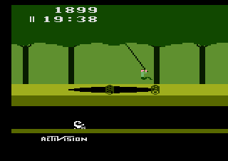

# Projeto  pitfall-atari
### FPRO/MIEIC, 2019/20
### Luísa Marques (up201907565@fe.up.pt)
### 1MIEIC04

#### Objetivo

Criar um clone do Pitfall Atari 2600 em Pygame

#### Descrição

*---Pitfall é um dos maiores clássicos do Atari 2600  e um dos jogos mais populares dos anos 80, que moldou as bases dos jogos de avnetura.---*

#### UI



### Pacotes

- Pygame

#### Tarefas

1. **NIVEIS**
   1. os níveis são naturalmente uma lista, sendo que cada nível é por si também uma lista de um dicionário com os objetos.
      cada nível é uma grelha 16x12, que é convertida para objetos em pixels.
```
levels = [
   # coordinates are defined as a 16x12 grid
    [{'obj': 'hole', 'gx': 5, 'gy': 10}, {'obj': 'snake', 'gx': 2, 'gy': 5}],
    ...,
    ...,
]
current_level = levels[0]
# convert grid coordinates to screen coordinates
objects = [{'x': 800*o['gx']/16, 'y': 600*o['gy']/12, **o} for o in current_level]
```
1. **NIVEIS (cont.)**
   1. desenhar os objetos : jogador, tronco, escorpião, lago, pântano, liana
   2. desenhar o fundo: árvores, abismos, escadas, muro
2. **JOGADOR**
   1. desenhar o jogador: pos_x, pos_y
   2. controlo esquerda-direita
   3. tecla space: salto_tempo = 50
   4. quando nao salta gravidade: pos_y += vel_y
   5. parar gravidade quando existe plataforma
3. **INTERACÇÃO**
   1. bounding-box entre tronco-jogador, jogador-objeto
   2. escada
   3. lago (jogador afunda no lago  evolta a posição inicial do nível)
   4. liana (jogador realiza trajetória da liana) 
4. **LIANA**
   1. movimento trignometrico

### 11/2019 a 01/2020
